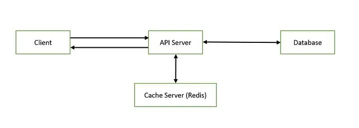

This is a [Next.js](https://nextjs.org/) project bootstrapped with [`create-next-app`](https://github.com/vercel/next.js/tree/canary/packages/create-next-app).

## Getting Started
First, install node modules:
```bash
npm install
```

Second, run the development server:
```bash
npm run dev
# or
yarn dev
# or
pnpm dev
# or
bun dev
```

Open [http://localhost:3000](http://localhost:3000) with your browser to see the result.

## Deploy on Vercel
The tutorial how to deploy next.js app on Vercel
- Option 1: [Use Vercel platform](https://nextjs.org/learn/pages-router/deploying-nextjs-app-deploy)
- Option 2: [Use github action](https://staticmania.com/blog/how-to-deploy-next-js-application-with-github-action) 
- Result: http://thy-khuu-porfolio.vercel.app

## Learn More
To learn more about Next.js, take a look at the following resources:
- [React Foundations](https://nextjs.org/learn/react-foundations)
- [Learn Next.js](https://nextjs.org/learn)

## Web Architecture
https://medium.com/@rahamatelahi2/implementing-redis-caching-in-a-full-stack-web-application-4f3291e3a0e8

